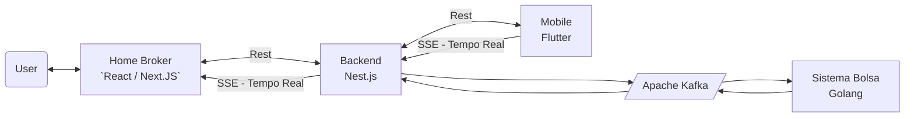
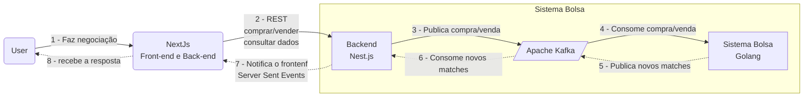
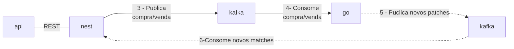

# Projeto de Homebroker

## Descrição do Projeto

O projeto consiste em um sistema de homebroker, onde o usuário pode comprar e vender ações, além de acompanhar o valor de cada ação em tempo real.

O projeto foi desenvolvido utilizando a linguagem Go, ReactJs/NextJs, Apache Kafka, NestJs, Docker e Fluter (Mobile).

### BIG PICTURE

## Tecnologias utilizadas

- Linguagem Go
- ReactJs/NextJs
- Apache Kafka
- NestJs
- Docker
- Flutter (Mobile)

## Arquitetura de projeto (Visão Geral)

# Projeto Go 
 

# Projeto Nest.js
## Arquitetura de projeto (Visão Detalhada Nest.js)

## Tecnologias utilizadas no projeto Nest

- TypesScript/Javascript
- Nest.js
- Prisma ORM
- Mongo DB
- Apache Kafka
- Docker
- REST 
- SSE (Server Sent Events)

## TODO

- [x] Criar projeto Nest.js
- [x] Criar o banco de dados Mongo e integrar com o Prisma ORM
- [ ] Criar rotas REST:
    - [x] Assets (Ativos)
    - [x] Wallets (Carteiras)
    - [x] Wallet Assets (Ativos da Carteira)
    - [x] Orders (Ordens de Compra e Venda)
- [x] Criar integração com o microserviço Golang (Matches) utilizando Apache Kafka
