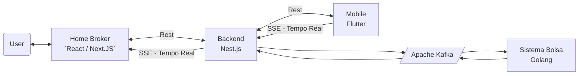

# Projeto de Homebroker

## Descrição do Projeto

O projeto consiste em um sistema de homebroker, onde o usuário pode comprar e vender ações, além de acompanhar o valor de cada ação em tempo real.

O projeto foi desenvolvido utilizando a linguagem Go, ReactJs/NextJs, Apache Kafka, NestJs, Docker e Fluter (Mobile).

### BIG PICTURE

## Tecnologias utilizadas

- Linguagem Go
- ReactJs/NextJs
- Apache Kafka
- NestJs
- Docker
- Flutter (Mobile)